# Senior Helper

Senior Helper is a full-stack web application designed for older adults and caregivers to stay organized, connected, and safer online. It combines practical care coordination features (shared appointments and caregiver links) with cybersecurity education (guided lessons, quizzes, and progress tracking) in a simple, high-legibility interface.<br><br>

## Screenshots

| Landing Page: Dark Mode | Landing Page: Light Mode |
| --- | --- |
| 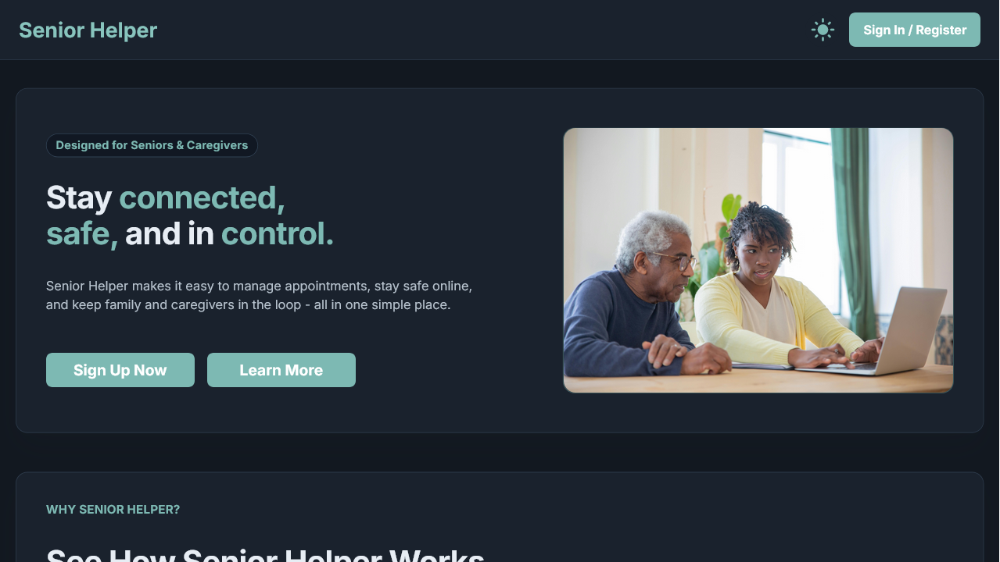 | 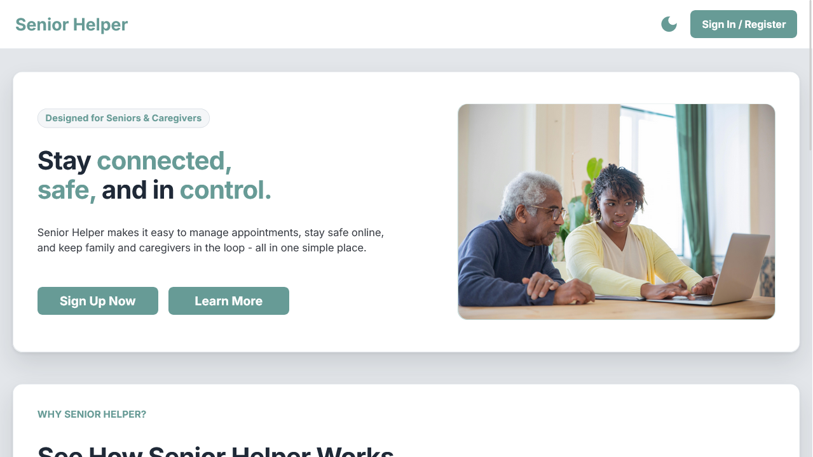 |

| Feature Overview | Team Section |
| --- | --- |
| 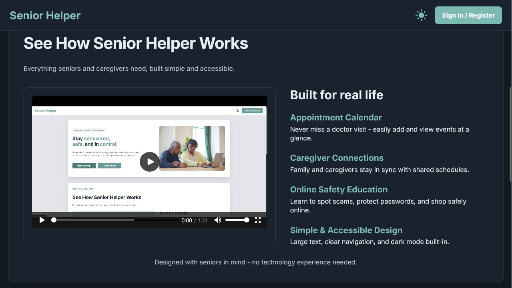 | 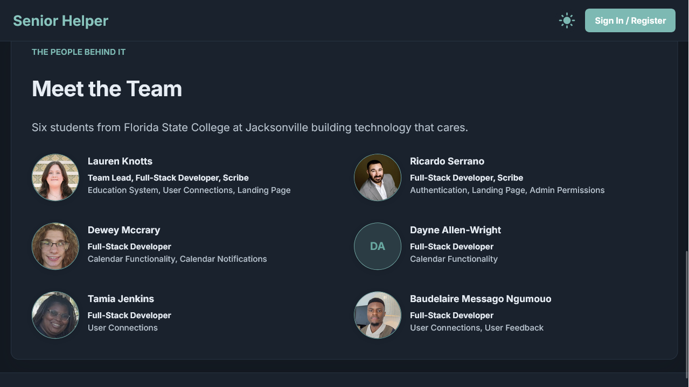 |

| Dashboard | Add Appointment |
| --- | --- |
| 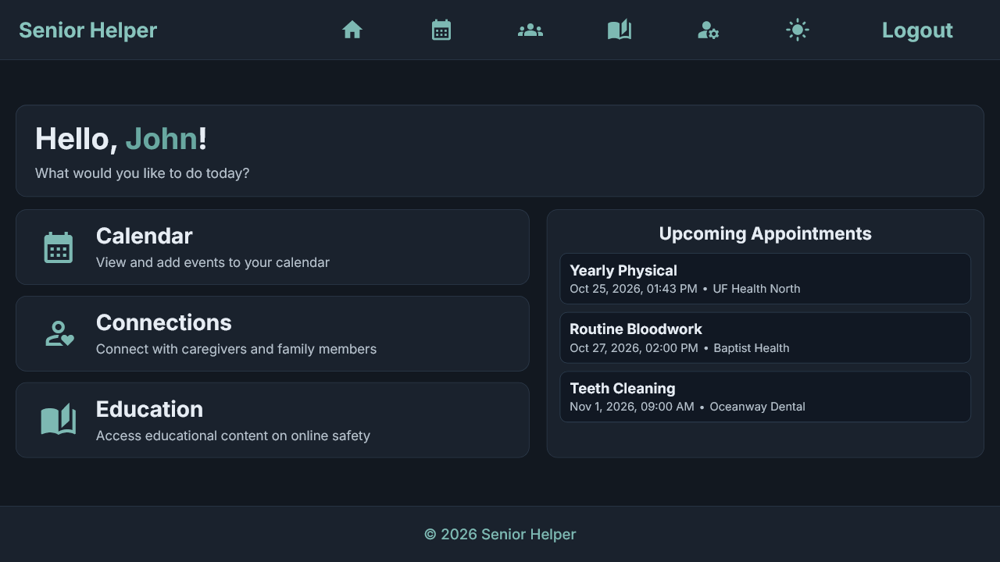 | 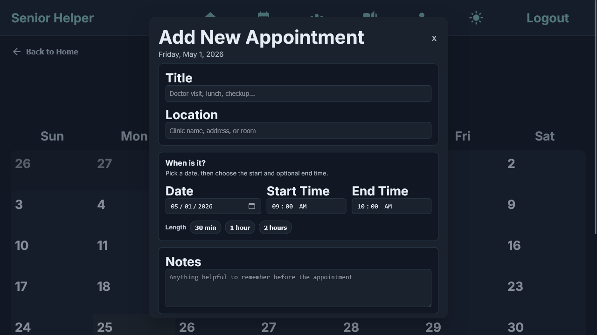 |

| Calendar | Education Modules |
| --- | --- |
| 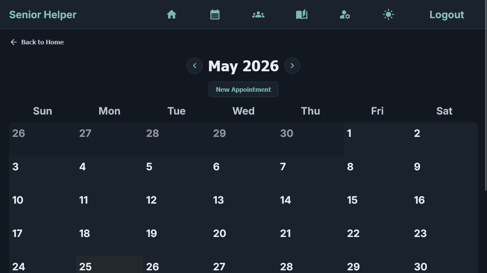 | 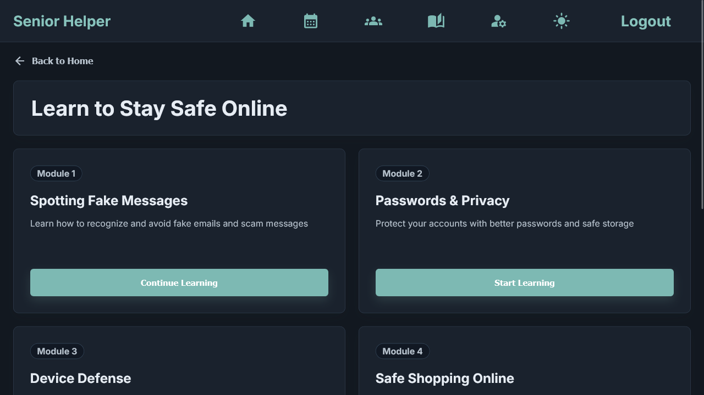 |

| Module Progress | Lesson Content |
| --- | --- |
| 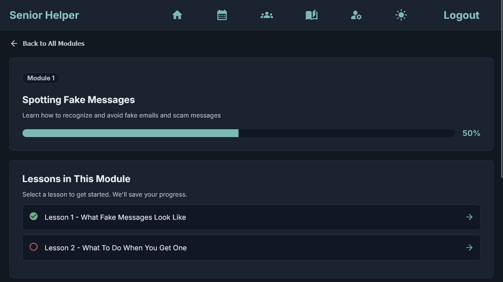 | 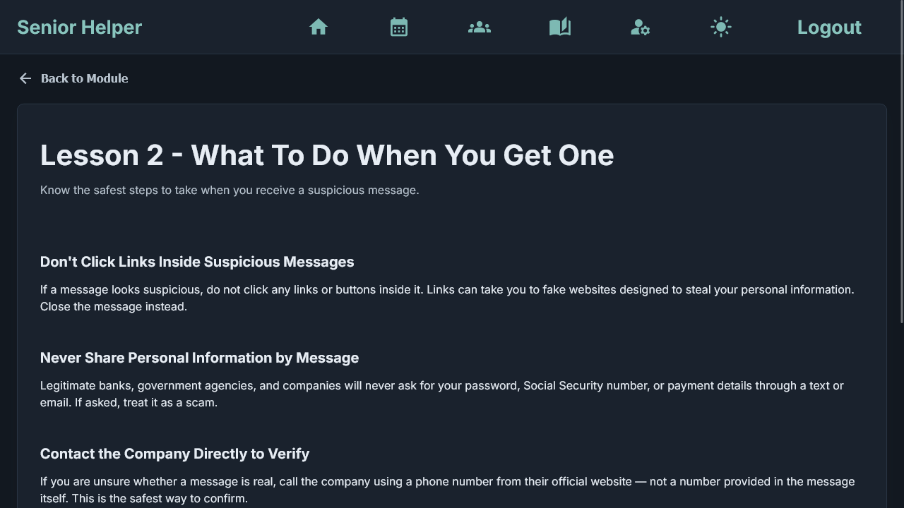 |

| Settings | Sign In |
| --- | --- |
| 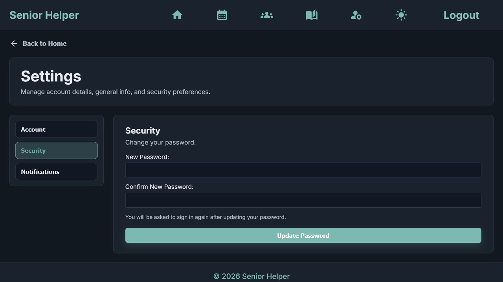 | 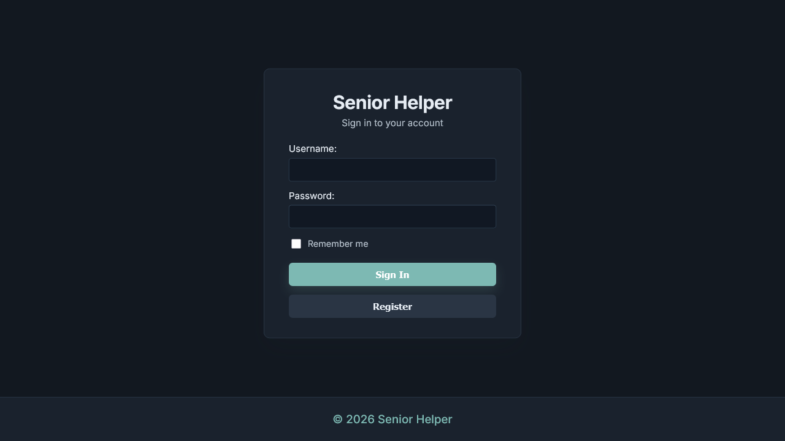 |

## Core Features

- Appointment calendar with create/edit flows, upcoming appointment summaries, and reminder notifications.
- Caregiver and family connections so trusted users can stay aligned around schedules and support needs.
- Online safety education modules covering fake messages, passwords, device defense, and safe shopping.
- Lesson progress tracking and module quizzes to reinforce cybersecurity topics.
- JWT-secured authentication with guarded routes, account settings, password updates, and role-aware workflows.
- Accessible visual design with large text, clear navigation, responsive layouts, and persistent light/dark mode.

## Architecture and Stack

- **Architecture:** Full-stack Spring Boot application with an Angular SPA packaged into the backend for single-app deployment.
- **Backend:** Java 17, Spring Boot 3.5, Spring MVC, Spring Data JPA, Spring Security, JWT auth, PostgreSQL, H2, Log4j2, and springdoc OpenAPI.
- **Frontend:** Angular 21 with standalone components, route guards, an HTTP auth interceptor, reactive/template forms, Cypress E2E support, and Vitest-based unit testing.
- **Build/Delivery:** Maven installs Node/npm, builds the Angular app in `SeniorHelper/frontend`, and copies the production browser assets into Spring Boot's public resources.

## Key UX and Accessibility Decisions

- Large typography and plain-language content to reduce cognitive and visual friction.
- Role-aware workflows for seniors, caregivers, and admins.
- Progress-first learning UX with module completion status, quiz scoring, and clear continue actions.
- Persistent light/dark theme, mobile-responsive layouts, and consistent navigation patterns.
- Form-first interaction with inline validation/error states and explicit labels/autocomplete hints.

## Running the Application

SeniorHelper is a Spring Boot backend with an Angular frontend. The project can be run in two common ways depending on whether you are actively developing the frontend or testing the packaged application.

The default backend configuration expects PostgreSQL at `localhost:5432`, database `seniorhelper_db`, username `postgres`, and password `postgres`.

### Option 1: Run Frontend and Backend Separately

Best for development. This enables live reload for frontend changes.

Start the backend:

1. In your IDE, open `SeniorHelper/src/main/java/seniorhelper/SeniorHelperApplication.java`.
2. Click Run.

Start the frontend:

```powershell
cd SeniorHelper/frontend
npm start
```

Open `http://localhost:4200`.

### Option 2: Run as a Single Packaged App

Deployment-style. This runs the full application from a single JAR.

Build the project:

```powershell
cd SeniorHelper
.\mvnw clean package
```

Run the application:

```powershell
java -jar target/SeniorHelper-0.0.1-SNAPSHOT.jar
```

Open `http://localhost:8080`.

## Contributors

- [Lauren Knotts](https://github.com/KnottsLauren) - Team Lead, Full-Stack Developer, Scribe
- [Ricardo Serrano](https://github.com/RickySerrano904) - Full-Stack Developer, Scribe
- [Dewey Mccrary](https://github.com/DeweyM1) - Full-Stack Developer
- [Dayne Allen-Wright](https://github.com/MasterShakespearianv) - Full-Stack Developer
- [Tamia Jenkins](https://github.com/FireSagg) - Full-Stack Developer
- [Baudelaire Messago Ngumouo](https://github.com/S3771361) - Full-Stack Developer